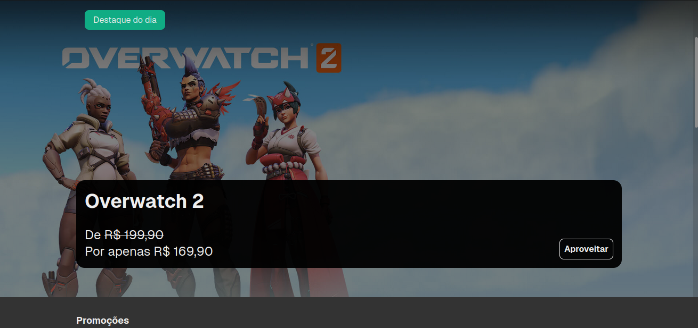
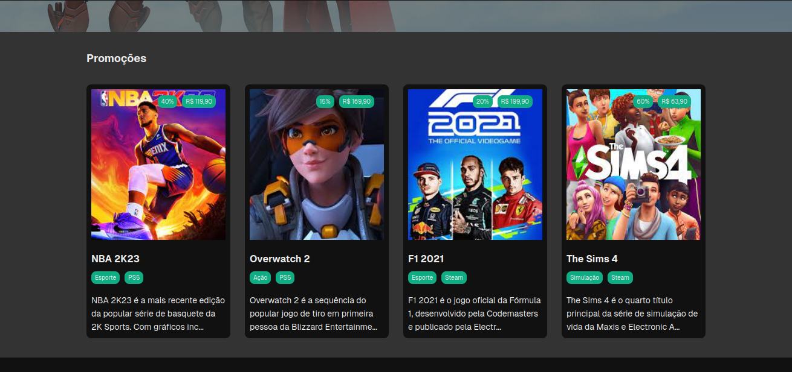
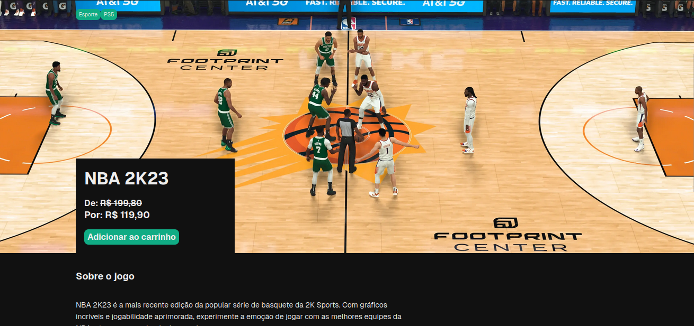
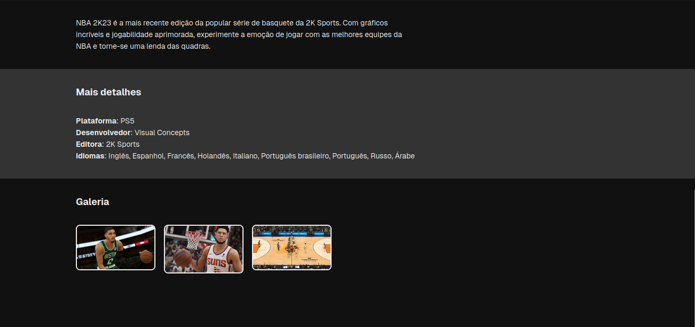

# Egames (Front-end)

Egames é um e-commerce de jogos desenvolvido por mim, utilizando React. O objetivo é proporcionar uma plataforma funcional e intuitiva, onde os usuários podem explorar jogos, filtrar por categorias e gerenciar um carrinho de compras. Este projeto foi criado como parte do meu portfólio para demonstrar minhas habilidades em front-end e boas práticas de desenvolvimento.

---

## ✨ Funcionalidades

- **Catálogo de Jogos**: Exibição de jogos recuperados diretamente de uma API.
- **Filtragem por Categorias**: Encontre rapidamente os jogos de interesse com filtros dinâmicos.
- **Carrinho de Compras**: Adicione e visualize os itens que deseja adquirir.

---

## 🚀 Tecnologias Utilizadas

- **React**: Biblioteca principal para construção da interface.
- **Redux Toolkit (RTK Query)**: Gerenciamento de estado global e integração com API.
- **TypeScript**: Tipagem estática para maior robustez e manutenção do código.
- **Styled Components**: Estilização moderna e modular.

---

## 🎯 Objetivo do Projeto

O Egames foi criado como um portfólio para demonstrar:
- Conhecimento avançado em **React** e **Redux Toolkit**.
- Uso de **TypeScript** para desenvolvimento seguro e escalável.
- Integração de estilização avançada com **styled-components**.
- Capacidade de consumir APIs externas e exibir dados de maneira eficiente.

---

## 🖼️ Preview do Projeto

---

## 📩 Contato

Gostou do projeto? Entre em contato comigo!  
📧 E-mail: [rafaeldamacena9304@gmail.com](mailto:rafaeldamacena9304@gmail.com)  
🌐 LinkedIn: [Rafael Damacena](https://www.linkedin.com/in/rafaeldamacena9304/)

---

## 🏆 Agradecimentos

A todos que reconhecem e incentivam o uso da tecnologia para proporcionar experiências incríveis e dinâmicas!

---

> Este projeto é parte do meu portfólio para fins educacionais e de demonstração.
